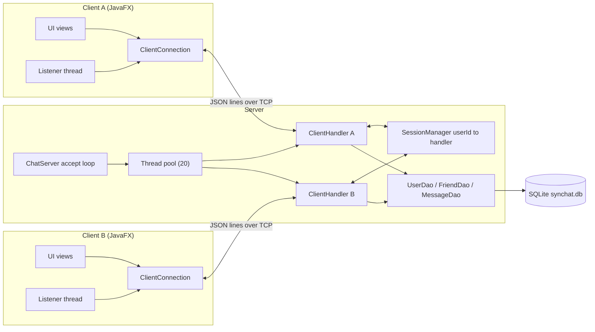
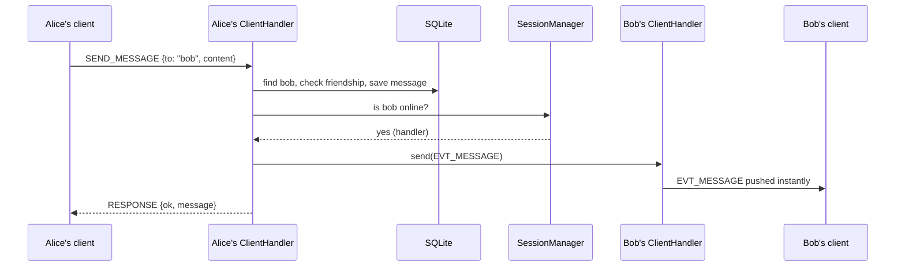
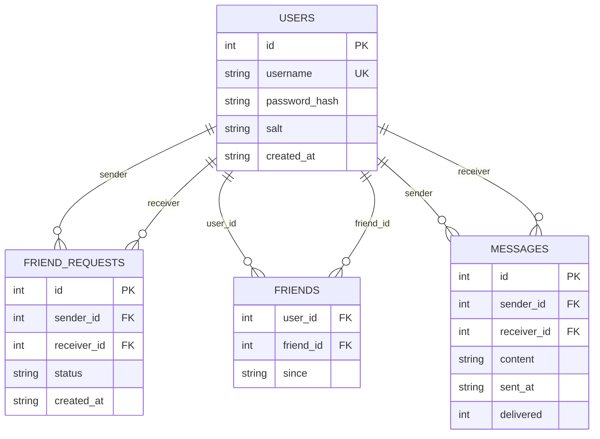

# SynChat

A desktop instant-messaging application that simulates a modern chat platform. A multi-threaded TCP server handles concurrent clients, authentication, friend requests and real-time private message routing; a JavaFX client talks to it over a line-based JSON protocol. Everything (server, protocol, client, database layer) is written from scratch, with no chat framework.

## Table of contents

1. [Features](#1-features)
2. [Tech stack](#2-tech-stack)
3. [Architecture](#3-architecture)
4. [Project structure](#4-project-structure)
5. [Messaging protocol](#5-messaging-protocol)
6. [Database schema](#6-database-schema)
7. [Getting started](#7-getting-started)
8. [Connecting a client to the server](#8-connecting-a-client-to-the-server)
9. [Quick demo walkthrough](#9-quick-demo-walkthrough)
10. [Bonus: Icebreaker (REST API + JSON parsing)](#10-bonus-icebreaker-rest-api--json-parsing)
11. [Troubleshooting](#11-troubleshooting)
12. [Security notes](#12-security-notes)

---

## 1. Features

| Area | What it does |
|---|---|
| Authentication | Register, log in, log out, live "is this username taken?" check, change password, delete account (password + typed confirmation) |
| Friend system | Search users, send a friend request, accept or reject; incoming requests appear live |
| Private messaging | Server resolves sender and receiver, checks friendship, stores the message, and pushes it to the receiver instantly |
| Offline delivery | Messages sent to an offline friend are queued in SQLite and delivered on their next login |
| Presence | Friends see each other go online and offline in real time |
| Multithreading | Bounded server thread pool (20 workers), one handler per client, plus a dedicated listener thread on every client |
| Protocol | Custom JSON-over-TCP protocol with request/response correlation and server-pushed events |
| Persistence | SQLite via plain JDBC, foreign keys with cascading deletes |
| GUI | JavaFX built entirely in Java code, no CSS (colors, borders and shadows come from the JavaFX API) |
| Bonus | Icebreaker button: fetches a joke from a public REST API over HTTP and parses the JSON response |

---

## 2. Tech stack

| Layer | Technology |
|---|---|
| Language | Java 17+ |
| GUI | JavaFX 21 (no CSS) |
| Networking | Java TCP sockets (`ServerSocket` / `Socket`) |
| Concurrency | `ExecutorService` fixed thread pool, `CompletableFuture`, `ConcurrentHashMap` |
| Database | SQLite |
| Database API | JDBC (`org.xerial:sqlite-jdbc`) |
| JSON | Gson |
| HTTP client | `java.net.http.HttpClient` (JDK 11+) |
| Build | Maven |
| IDE | IntelliJ IDEA |
| Version control | Git + GitHub |

---

## 3. Architecture

### 3.1 System overview



### 3.2 Server

- `ChatServer` runs one `accept()` loop and hands every accepted socket to a **fixed pool of 20 threads**. Connection 21 waits in the queue until a worker frees up, so the server can never spawn unbounded threads.
- `ClientHandler` is a `Runnable`: one instance per connected socket. It reads a line, parses it into a `Packet`, dispatches it, and writes back a correlated response.
- `SessionManager` is the routing table: a `ConcurrentHashMap<userId, ClientHandler>`. To deliver a message, the sender's handler looks the receiver up here and writes straight into the receiver's socket. `ClientHandler.send()` is `synchronized` because several threads may write to the same socket.
- The DAOs are stateless and open one short-lived JDBC connection per call. The database runs in WAL mode so readers never block on the writer.

### 3.3 Client

- The JavaFX thread never blocks on I/O. `ClientConnection.request()` returns a `CompletableFuture` immediately.
- A dedicated **listener thread** sits in `readLine()`. Each incoming packet is either a response to a pending request (completes the matching future by its `id`) or a server push (dispatched to registered listeners).
- All UI updates from other threads go through `Platform.runLater(...)`.

### 3.4 Message routing



If Bob is offline, the message is stored with `delivered = 0` and replayed to him the moment he logs in.

---

## 4. Project structure

```
synchat/
├── pom.xml
├── README.md
├── .gitignore
├── synchat.db                      (created on first server start, git-ignored)
└── src/main/java/com/synchat/
    ├── common/                     shared by client and server
    │   ├── Protocol.java           wire constants (request/event names, host, port)
    │   ├── Packet.java             the JSON envelope: toJson() / fromJson()
    │   ├── JsonUtil.java           shared Gson instance
    │   └── dto/
    │       ├── UserDto.java
    │       ├── FriendRequestDto.java
    │       └── ChatMessageDto.java
    ├── server/
    │   ├── ServerMain.java         entry point
    │   ├── ChatServer.java         accept loop + bounded thread pool
    │   ├── ClientHandler.java      one thread per client, request dispatch and routing
    │   ├── SessionManager.java     userId -> ClientHandler routing table
    │   ├── db/
    │   │   ├── Database.java       connection factory + schema creation
    │   │   ├── UserDao.java
    │   │   ├── FriendDao.java
    │   │   └── MessageDao.java
    │   └── util/
    │       └── PasswordUtil.java   salted SHA-256 hashing
    └── client/
        ├── ClientApp.java          JavaFX Application, opens the connection, navigation
        ├── Launcher.java           plain main() that starts ClientApp (see section 7.3)
        ├── net/
        │   └── ClientConnection.java   socket, listener thread, futures, event listeners
        ├── ui/
        │   ├── LoginView.java
        │   ├── RegisterView.java
        │   ├── MainView.java       chat window (BorderPane, TabPane, ListViews)
        │   ├── Dialogs.java        change password / delete account dialogs
        │   └── Theme.java          colors and styling helpers (pure Java, no CSS)
        └── Joke_api/
            ├── Joke.java           POJO for the JokeAPI JSON response
            └── JokeApiClient.java  HttpClient GET + Gson parsing
```

---

## 5. Messaging protocol

**Transport:** plain TCP, UTF-8, **one JSON document per line** terminated by `\n`. Every packet uses the same envelope:

```json
{ "type": "SEND_MESSAGE", "id": "c-14", "data": { "to": "bob", "content": "hi" } }
```

| Field | Meaning |
|---|---|
| `type` | The operation or event name |
| `id` | Correlation id created by the client. The server copies it into its reply so the client can match reply to request. `null` on server pushes |
| `data` | Payload object |

Every reply has `type = "RESPONSE"` and `data.ok` (boolean). When `ok` is `false`, `data.message` explains why.

### Client to server

| type | data in | data out on success |
|---|---|---|
| `REGISTER` | `username`, `password` | `message` |
| `LOGIN` | `username`, `password` | `username`, `userId` |
| `LOGOUT` | none | `message` |
| `CHECK_USERNAME` | `username` | `available`, `message` |
| `CHANGE_PASSWORD` | `oldPassword`, `newPassword` | `message` |
| `DELETE_ACCOUNT` | `password` | `message` |
| `SEARCH_USER` | `query` | `users[]` |
| `FRIEND_ADD` | `username` | `message` |
| `FRIEND_RESPOND` | `requestId`, `accept` | `message` |
| `FRIEND_LIST` | none | `friends[]` |
| `REQUEST_LIST` | none | `requests[]` |
| `SEND_MESSAGE` | `to`, `content` | `message` (the stored message) |
| `HISTORY` | `peer` | `messages[]` |

### Server pushes (`id` is `null`)

| type | data |
|---|---|
| `EVT_MESSAGE` | `message`: a new private message |
| `EVT_FRIEND_REQUEST` | `request`: someone wants to be your friend |
| `EVT_FRIEND_RESULT` | `username`, `accepted` |
| `EVT_FRIEND_REMOVED` | `username`: that friend deleted their account |
| `EVT_PRESENCE` | `username`, `online` |
| `EVT_SERVER_NOTICE` | `message` |

### Example exchange

```
C -> {"type":"LOGIN","id":"c-1","data":{"username":"alice","password":"secret"}}
S -> {"type":"RESPONSE","id":"c-1","data":{"ok":true,"username":"alice","userId":1}}

C -> {"type":"SEND_MESSAGE","id":"c-2","data":{"to":"bob","content":"hey"}}
S -> {"type":"RESPONSE","id":"c-2","data":{"ok":true,"message":{...}}}

(meanwhile, in Bob's client, pushed with no id)
S -> {"type":"EVT_MESSAGE","data":{"message":{"id":9,"from":"alice","to":"bob","content":"hey","sentAt":"2026-09-28 14:03:11"}}}
```

JSON is generated in memory and never written to disk: `Packet.toJson()` serializes an object to a string before it is written to the socket, and `Packet.fromJson()` parses it back on the other side.

---

## 6. Database schema

SQLite, accessed through plain JDBC with `PreparedStatement`s. The schema is created automatically on first server start by `Database.init()`.



### Tables

- **`users`**: the root table; every other table references it. `username` is `UNIQUE COLLATE NOCASE`. Passwords are never stored in clear text: each account has a random 16-byte `salt` and the table keeps `SHA-256(salt + password)`.
- **`friend_requests`**: `status` is `PENDING`, `ACCEPTED` or `REJECTED`. `UNIQUE(sender_id, receiver_id)` prevents duplicate requests. Rows are updated, not deleted, when answered.
- **`friends`**: each friendship is stored **twice** (`a -> b` and `b -> a`), with the primary key on the pair `(user_id, friend_id)`. "Who are my friends?" is then a single indexed lookup with no `OR`.
- **`messages`**: every private message. `delivered = 0` marks the offline queue.

### How the relationships are established

Every user-referencing column is a foreign key with `ON DELETE CASCADE`:

```sql
CREATE TABLE friend_requests (
    id          INTEGER PRIMARY KEY AUTOINCREMENT,
    sender_id   INTEGER NOT NULL REFERENCES users(id) ON DELETE CASCADE,
    receiver_id INTEGER NOT NULL REFERENCES users(id) ON DELETE CASCADE,
    status      TEXT NOT NULL DEFAULT 'PENDING',
    created_at  TEXT NOT NULL DEFAULT (datetime('now','localtime')),
    UNIQUE (sender_id, receiver_id)
);
```

- SQLite ships with foreign key enforcement **off**, so `Database.getConnection()` runs `PRAGMA foreign_keys = ON` on every connection.
- Because of the cascade, `DELETE FROM users WHERE id = ?` also removes that user's friendships, friend requests and messages in one statement. This is what makes "Delete account" a single-statement operation.
- Accepting a friend request updates the request row and inserts both friendship rows inside **one transaction**, so a half-written friendship can never be observed.

### Indexes

| Index | Purpose |
|---|---|
| `idx_msg_pair` on `messages(sender_id, receiver_id)` | Fast conversation history between two users |
| `idx_req_receiver` on `friend_requests(receiver_id, status)` | Fast "my pending requests" |

The database runs with `PRAGMA journal_mode = WAL` and `PRAGMA busy_timeout = 5000`.

### CRUD map

| Operation | Where |
|---|---|
| Create | `UserDao.create`, `FriendDao.createRequest`, `MessageDao.save` |
| Read | `UserDao.findByUsername` / `search`, `FriendDao.friendsOf` / `pendingFor`, `MessageDao.history` / `undeliveredFor` |
| Update | `UserDao.updatePassword`, `FriendDao.respond`, `MessageDao.markDelivered` |
| Delete | `UserDao.delete` (cascades to friends, requests and messages) |

---

## 7. Getting started

### 7.1 Prerequisites

- **JDK 17 or newer**
- **IntelliJ IDEA** (recommended) or Maven 3.8+ on your PATH
- Internet access on first build, so Maven can download JavaFX, Gson and sqlite-jdbc

### 7.2 Get the code and build

```bash
git clone https://github.com/<your-username>/SynChat.git
cd SynChat
mvn clean compile
```

In IntelliJ: **File > Open**, select the folder that directly contains `pom.xml`, and wait for the Maven import to finish. If the dependencies show as unresolved, open the Maven tool window and click **Reload All Maven Projects**.

If IntelliJ cannot resolve `javafx-controls`, pin your platform classifier in `pom.xml` (`win`, `linux`, `linux-aarch64`, `mac`, `mac-aarch64`) as described in [Troubleshooting](#11-troubleshooting).

### 7.3 Start the server

The server must be running **before** any client starts.

**Option A: IntelliJ (recommended)**

1. **Run > Edit Configurations > + > Application**
2. Name: `Server`
3. Main class: `com.synchat.server.ServerMain`
4. Use classpath of module: `synchat`
5. Click **Run**

**Option B: Maven**

```bash
mvn exec:java
```

Expected console output:

```
[DB ] schema ready -> synchat.db
[SRV] SynChat server listening on port 5555 (all interfaces)
[SRV] worker pool size = 20
```

`synchat.db` is created in the working directory on first start. The server listens on **port 5555**.

### 7.4 Start a client

**Option A: IntelliJ (recommended)**

1. **Run > Edit Configurations > + > Application**
2. Name: `Client`
3. Main class: `com.synchat.client.Launcher`
4. Use classpath of module: `synchat`
5. **Modify options > Allow multiple instances** (so you can open two client windows)
6. Click **Run**. Run it again for a second window.

> **Why `Launcher` and not `ClientApp`?** `ClientApp` extends `javafx.application.Application`. When the JVM is asked to start such a class directly and JavaFX is not on the module path, it can refuse with *"JavaFX runtime components are missing"*. `Launcher` is a plain class whose `main()` just calls `ClientApp.main(args)`, which sidesteps that check.

**Option B: Maven**

```bash
mvn javafx:run
```

---

## 8. Connecting a client to the server

The address the client connects to is chosen when the client program starts, through the `server.host` system property. If it is not set, the client connects to `127.0.0.1` (the same machine as the server).

### 8.1 Client and server on the same computer

Nothing to configure. Start the server, then start one or more clients.

### 8.2 Client on a different computer (same network)

**On the server computer**

1. Find its LAN IP address:
   ```powershell
   ipconfig
   ```
   Use the `IPv4 Address` of the active adapter, for example `192.168.1.23`.
2. Set the Wi-Fi network profile to **Private** (Settings > Network & internet > Wi-Fi > your network).
3. Allow the port through Windows Firewall (run PowerShell as Administrator):
   ```powershell
   netsh advfirewall firewall add rule name="SynChat" dir=in action=allow protocol=TCP localport=5555
   ```
4. Start the server (section 7.3).
5. Optional check from the server machine itself:
   ```powershell
   Test-NetConnection -ComputerName 192.168.1.23 -Port 5555
   ```
   `TcpTestSucceeded : True` means the server and firewall rule are fine.

**On the client computer**

1. Get the project onto that machine (clone or copy) and open it in IntelliJ.
2. **Run > Edit Configurations > Client**
3. **Modify options > Add VM options**, then enter the server's IP:
   ```
   -Dserver.host=192.168.1.23
   ```
4. Apply and run the client.

Both computers must be on the **same network**. Guest Wi-Fi, campus Wi-Fi with client isolation, and VPNs commonly block this.

### 8.3 Summary

| Where the client runs | Server address | What to do |
|---|---|---|
| Same computer as the server | `127.0.0.1` (default) | Nothing |
| Another computer on the same network | server's LAN IP | Add VM option `-Dserver.host=<ip>` to the client run configuration |

---

## 9. Quick demo walkthrough

1. Start the server and watch the console.
2. Start two clients.
3. **Client A:** Create account, register `alice`, then log in.
4. **Client B:** register `bob`, then log in.
5. **Client B:** open the **Search** tab, type `ali`, select alice, click **Send friend request**.
6. **Client A:** the **Requests (1)** tab updates instantly. Select the request and click **Accept**.
7. Both sides now list each other under **Friends** with a green presence dot when online.
8. Click a friend, type a message and press Enter. It appears in the other window with no refresh.
9. Close Client B, send Alice's message anyway, then log Bob back in: the queued message is delivered.
10. Try **Change password**, **Log out**, and **Delete account** (requires your password and typing `DELETE`; your friends' lists update live).

### Resetting to a clean state

Stop the server and the clients, then delete the database and restart the server:

```powershell
Remove-Item synchat.db, synchat.db-shm, synchat.db-wal -ErrorAction SilentlyContinue
```

---

## 10. Bonus: Icebreaker (REST API + JSON parsing)

Next to the message box there is a **Icebreaker** button. With a conversation open, clicking it:

1. Runs a background thread (`HttpClient.send()` blocks, so it must stay off the JavaFX thread).
2. Sends an HTTP `GET` to `https://v2.jokeapi.dev/joke/Any?type=single&safe-mode` (no API key needed; `safe-mode` filters out offensive jokes).
3. Parses the JSON response body into a `Joke` object with Gson (`JsonUtil.GSON.fromJson(body, Joke.class)`).
4. Drops the joke text into the message box, via `Platform.runLater(...)`, ready to edit or send.

Code: `client/Joke_api/JokeApiClient.java` and `Joke.java`. This needs an internet connection; if the request fails the status label shows the error and the app keeps running.

---

## 11. Troubleshooting

| Problem | Cause and fix |
|---|---|
| `package com.google.gson does not exist` | Maven has not imported the project. Right-click `pom.xml > Add as Maven Project`, or Maven tool window > Reload All Maven Projects |
| `Unresolved dependency: org.openjfx:javafx-controls` | Platform auto-detection failed. Add `<classifier>win</classifier>` (or your platform) to the `javafx-controls`, `javafx-base` and `javafx-graphics` dependencies in `pom.xml` |
| `mvn` is not recognized | Maven is not installed or not on PATH. Use IntelliJ's Maven tool window, or install with `winget install Apache.Maven` |
| "JavaFX runtime components are missing" | Run `com.synchat.client.Launcher`, not `ClientApp` |
| Client shows "Server unavailable" | The server is not running or not reachable. Start it first, and check the IP and firewall if it is on another machine |
| Client on another laptop times out | Wrong IP, different networks, Wi-Fi client isolation, VPN, or firewall. Use `Test-NetConnection` from that laptop |
| Server prints `listening on 127.0.0.1` | You are running an older `ChatServer`. It must create `new ServerSocket(port, 50)` (all interfaces) to accept remote clients |
| Client windows lose connection after a server restart | Expected: close and relaunch the clients |
| Login says "already logged in somewhere else" | One live session per account; log out of the other window first |
| Port 5555 already in use | Another server instance is still running; stop it in IntelliJ |
| Icebreaker shows an error | No internet, or the API is unreachable from your network |

---

## 12. Security notes

- Passwords are salted and hashed (SHA-256) before storage and compared in constant time.
- Chat traffic is **plain-text JSON over TCP with no TLS**. It is meant for a local or trusted network. Do not expose the server to the open internet without adding encryption (for example `SSLServerSocket`).
- Every SQL statement uses `PreparedStatement`, so user input cannot inject SQL.
- The server enforces that messages can only be sent between accepted friends, not the UI.
- One account can hold only one live session at a time.

---

## Version control

```bash
git add .
git commit -m "describe your change"
git push
```

`synchat.db`, `target/` and IDE folders are excluded by `.gitignore`.